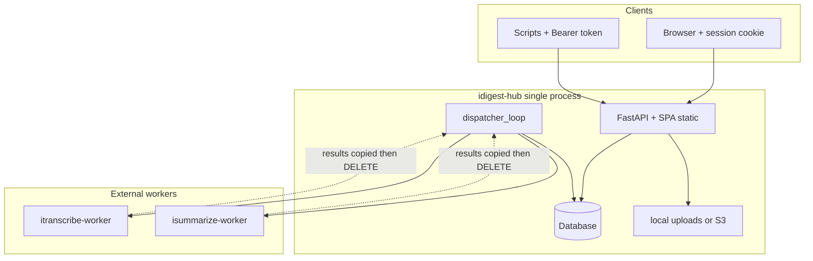

# Architecture overview

[idigest-hub](https://github.com/) is an on-premise **multi-tenant control plane** for audio transcription and summarization. End users and integrators talk only to the hub. External worker services perform compute; the hub owns identity, billing, artifacts, and its own task queue.

## Components

| Layer | Location | Responsibility |
| ----- | -------- | -------------- |
| **Web UI** | `web/` → `web/dist` | React SPA: library, tasks, org admin, instance admin |
| **HTTP API** | `app/main.py`, `app/routers/` | FastAPI on `/api/v1/*`; serves SPA from same origin |
| **Dispatcher** | `app/services/dispatcher.py` | Background loop: health checks, dispatch, poll, billing on success |
| **Database** | SQLite (default) or PostgreSQL | Orgs, users, tasks, encrypted artifacts metadata |
| **File storage** | `app/services/storage.py` | Audio blobs: local disk (`STORAGE_BACKEND=local`) or S3-compatible object storage with SSE (`STORAGE_BACKEND=s3`) |
| **Workers** | External processes | `itranscribe-worker`, `isummarize-worker` — registered by instance admin |



## Design principles

1. **Single origin** — API and UI share one host/port (default `8080`). Session cookie is `HttpOnly` + `SameSite=Lax`; no CORS for normal browser use.
2. **Workers are opaque** — Org users never see worker URLs or tokens. Only `instance_admin` registers nodes in Instance → Workers.
3. **Hub-owned queue** — Clients `POST` a task → **202** + `task_id` → poll `GET /tasks/{id}`. The hub mirrors worker state and persists finished artifacts locally.
4. **Tariff snapshot** — Pricing and limits at task creation time are stored on the `Task` row (`snap_*` fields) so later tariff changes do not affect in-flight or historical billing.
5. **One Uvicorn worker** — Rate limits and dispatcher state live in process memory. Always run `--workers 1`.

## Process lifecycle

On startup (`app/main.py` lifespan):

1. Load settings from `.env`
2. Create `{DATA_DIR}`, run SQLAlchemy `create_all` + Alembic-style `ensure_schema`
3. Start `dispatcher_loop` (async background task, polls every `DISPATCH_POLL_SEC`, default 1s)
4. Start `rate_limit_sweeper` (expires in-memory buckets)

On shutdown: cancel background tasks cleanly.

## Tenancy model

```
Instance (single deployment)
├── instance_admin (one user, created at /setup)
├── InstanceSettings (SMTP, ASR models, rate limits, allow_new_orgs)
├── WorkerNodes[] (transcribe | summarize)
├── Tariffs[]
└── Organizations[]
    ├── org_admin / org_member users (one org per user)
    ├── balance + tariff
    └── artifacts: Audio, Transcript, Summary, Skill, Task
```

- **Signup** creates a personal org (`is_personal=true`) and makes the user `org_admin`.
- **Instance admin** has no org membership by default; manages the whole instance and can **impersonate** org users for support.

## Data flow (high level)

1. User uploads audio → `POST /audios` → storage backend persists blob + `Audio` row
2. User starts transcribe → `POST /tasks/transcribe` → `Task` queued → dispatcher materializes local path (temp file for S3) and POSTs file to worker
3. Worker completes → hub encrypts utterances → `Transcript` row → charges wallet → `DELETE` worker task
4. User starts summarize → `POST /tasks/summarize` with `skill_ids` → dispatcher sends text + combined skills to summarize worker
5. Success → encrypted `Summary` body → billing → worker task deleted

See [request-flow.md](request-flow.md) for step-by-step sequences.

## Related pages

- [Request flow](request-flow.md)
- [Security](security.md)
- [Tasks](../domain/tasks.md)
- [Workers](../operations/workers.md)
