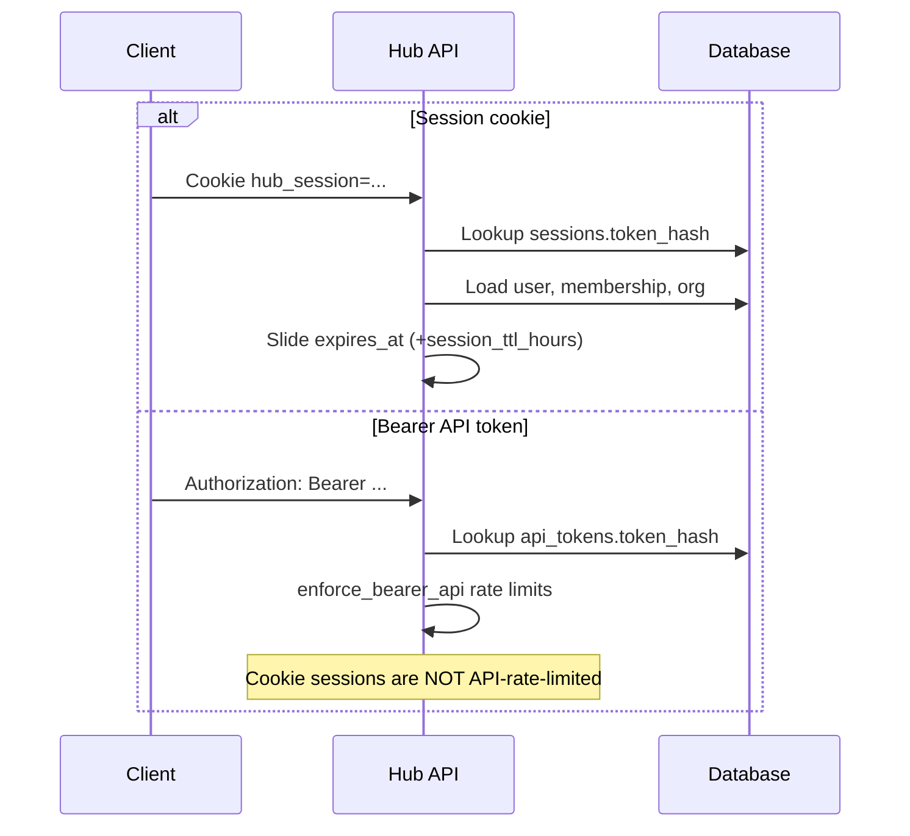
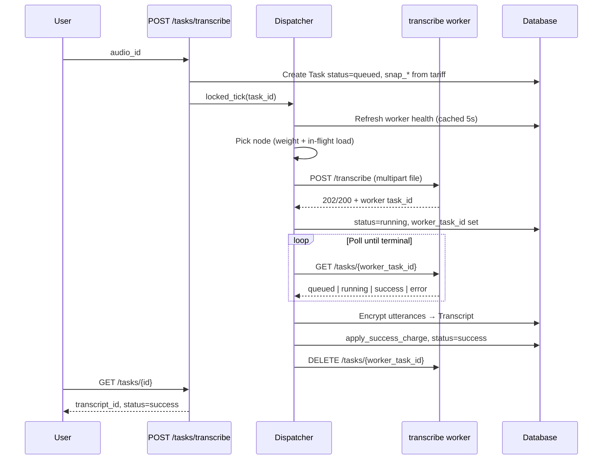

# Request flow

This page describes how HTTP requests move through authentication, task creation, and the background dispatcher.

## Authentication paths

Resolution lives in `app/deps.py` → `resolve_auth()`. Failures return HTTP **401** with `error.code = unauthorized` (or `must_change_password`, `api_disabled` for Bearer).

### Session sliding

Middleware in `app/main.py` re-issues the session cookie on successful responses if the browser did not already receive a new `Set-Cookie`. Each authenticated request extends `expires_at` by `session_ttl_hours` from instance settings (default 24 h, configurable in Instance → Settings).

## Transcribe task flow

### Pool states (transcribe)

Before dispatch, the dispatcher classifies the transcribe pool:

| State | Meaning |
| ----- | ------- |
| `ready` | At least one enabled node has ASR + diarization engines `loaded` |
| `waiting` | Enabled nodes exist but engines loading/unavailable — **no dispatch timeout** (`retry_without_timeout=true`) |
| `empty` | No enabled nodes, or none match required models |

If pool is `empty` longer than `DISPATCH_NO_CANDIDATE_SEC` (default 3600s), task fails with `error.code = dispatch_timeout`.

## Summarize task flow

Similar to transcribe, but:

1. Hub decrypts transcript utterances and formats them as `speaker: text` lines
2. Skills are loaded by `skill_ids`, combined as `## name\n\nbody` sections
3. Payload size = transcript UTF-8 + skills UTF-8; max `MAX_SUMMARIZE_PAYLOAD_BYTES` (10 MiB)
4. Worker pool uses `GET /ready` (HTTP 200) instead of engine map
5. Billing: fixed job fee + per-1000-character units of **output** summary text

## Poll on read

`GET /tasks/{task_id}` triggers `locked_tick` when status is `queued` or `running`. UI polling and API clients benefit without waiting for the background loop alone.

Background loop (`dispatcher_loop`) processes **all** queued/running tasks every `DISPATCH_POLL_SEC` and also runs audio retention purge.

## Worker 404 redispatch

If poll returns **404** from the worker and the hub has not yet persisted a result:

- Clear `worker_id` / `worker_task_id`
- Set status back to `queued`
- Next tick dispatches to another node

If the hub already has `produced_transcript_id` or `produced_summary_id`, 404 is ignored (cleanup race).

## Cancel

`DELETE /tasks/{task_id}` only when:

- `status == queued`
- `worker_task_id` is still null (not yet dispatched)

Sets `status=error`, `error.code=canceled`. Once dispatched, cancel is rejected with `task_running`.

## Error propagation

Worker errors are mapped via `WORKER_ERROR_MAP` in `app/services/workers.py` to hub-facing codes on the task (`pipeline_error`, `engine_unavailable`, `invalid_file`, etc.). See [API errors](../api/README.md#error-codes).

## Related pages

- [Tasks](../domain/tasks.md)
- [Workers](../operations/workers.md)
- [Billing](../domain/billing.md)
