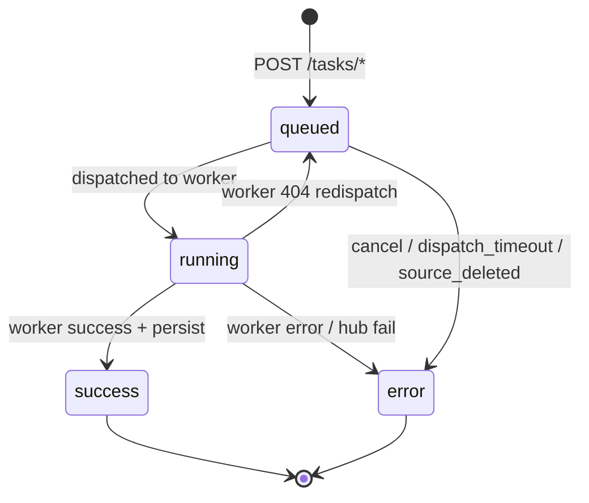

# Tasks

Hub tasks are the user-visible queue for transcribe and summarize work. They decouple client polling from worker internals.

## Types

| type | Input | Output |
| ---- | ----- | ------ |
| `transcribe` | `audio_id` | `produced_transcript_id` |
| `summarize` | `transcript_id` + `skill_ids[]` | `produced_summary_id` |

## Status lifecycle



| status | Meaning |
| ------ | ------- |
| `queued` | Waiting for worker or engine |
| `running` | Dispatched; `worker_task_id` set |
| `success` | Artifact persisted, worker cleaned up |
| `error` | Terminal; see `error.code` |

### Meta stages (`task.meta.stage`)

Non-exhaustive values during processing:

- `queued`, `waiting_engine`, `queue_full`, `dispatched`
- Worker-reported `queued` / `running` while polling

## Create

Both return **HTTP 202** and task JSON (`task_id`, `status`, …).

Prerequisites:

- User in an org
- Positive balance (unless unlimited tariff)
- Readable source artifact
- Summarize: at least one skill_id

Immediate `locked_tick` after insert tries to dispatch without waiting for background loop.

## Transcription models (snapshot)

Transcribe and import-with-transcribe tasks store models at creation time:

| Field | Source |
| ----- | ------ |
| `snap_asr_model` | User `asr_model` if set, else instance `asr_model` |
| `snap_diarization_model` | User `diarization_model` if set (`""` = disabled), else instance `diarization_model` |

Resolution order: **user profile → instance settings**. Changing settings or profile later does not affect already-queued tasks.

Available choices are the union of models registered on enabled transcribe workers. Instance admin sets defaults in **Instance → Settings → Service models**. Users may override in **Profile → Transcription models** (inherit / off / specific model).

Clients cannot pass models in `POST /tasks/transcribe` — only the resolved defaults apply.

## Summarize model (snapshot)

Summarize tasks store the LLM name at creation time:

| Field | Source |
| ----- | ------ |
| `snap_summarize_model` | User `summarize_model` if set, else instance `summarize_model`. If both are empty and workers report names, the first available name is used. |

Resolution order: **user profile → instance settings**. Later profile or settings changes do not rewrite an already created task.

Available names are the union of models reported by enabled summarize workers (`GET /health`). Instance admin sets the default in **Instance → Settings → Service models**. Users may override in **Profile → Summarize model** (inherit or a specific name).

Clients cannot pass the model in `POST /tasks/summarize`.

## Poll

`GET /tasks/{task_id}` — triggers tick when status is `queued` or `running`.

Response shape (`task_public`):

```json
{
  "task_id": "uuid",
  "type": "transcribe",
  "status": "success",
  "meta": { "stage": "done", "audio_duration_sec": 120.5 },
  "transcript_id": "uuid",
  "summary_id": null,
  "error": null,
  "org_id": "...",
  "user_id": "...",
  "audio_id": "...",
  "source_transcript_id": null,
  "created_at": "...",
  "updated_at": "..."
}
```

On error: `"error": { "code": "dispatch_timeout" }`.

## List

`GET /tasks` — ordered by `updated_at` desc. Instance admin may filter `org_id`, `user_id`. Org admin may filter `user_id`.

Extra fields for admins: `owner_email`, `org_name`, `audio_filename`.

## Cancel

`DELETE /tasks/{task_id}`

- Owner or org_admin within org
- Only while `status=queued` and not yet dispatched (`worker_task_id` is null)
- Sets `error.code=canceled`

## Dispatcher selection

Worker choice among candidates:

1. Filter enabled nodes matching type and readiness
2. Score by `in_flight / weight` (lower is better)
3. Tie-break toward higher `weight`

Transcribe candidates must satisfy **all** of:

1. Node type `transcribe`, enabled
2. `snap_asr_model` in node’s `asr_models_json` (or legacy: inferred from `/health`)
3. If `snap_diarization_model` is set — same for diarization list
4. `/health` reports both engines as `loaded`

Summarize candidates must satisfy **all** of:

1. Node type `summarize`, enabled
2. `/ready` HTTP 200
3. Node offers `snap_summarize_model` (health `model` / `llm_model` / `llm` equals the snapshot). A node with no model name in health matches any snapshot.

If enabled summarize workers exist but none offer the snapshotted name, the task stays `queued` with `meta.stage` `no_matching_worker`.

## Failure codes (task.error.code)

| code | Typical cause |
| ---- | ------------- |
| `dispatch_timeout` | No worker available for `DISPATCH_NO_CANDIDATE_SEC` |
| `canceled` | User DELETE while queued |
| `source_deleted` | Audio/transcript removed before persist |
| `text_too_long` | Summarize payload > 10 MiB |
| `payload_too_large` | Worker rejected upload size |
| `engine_unavailable` | Models not loaded (may retry) |
| `pipeline_error` | Generic worker/processing failure |
| `invalid_file` | Bad audio |
| `not_found` | Missing skill reference |

Worker codes mapped in `app/services/workers.py` → hub codes.

## Billing hook

On success only: `apply_success_charge()` using snapshotted prices. Failed tasks are not billed.

## Background processing

`dispatcher_loop` every `DISPATCH_POLL_SEC` (1s):

1. Refresh worker health (5s cache per node)
2. Poll running tasks
3. Dispatch queued tasks
4. Run audio retention purge

Configurable via `.env`:

| Variable | Default |
| -------- | ------- |
| `DISPATCH_NO_CANDIDATE_SEC` | 3600 |
| `DISPATCH_POLL_SEC` | 1.0 |
| `WORKER_HTTP_TIMEOUT_SEC` | 30 |
| `WORKER_UPLOAD_TIMEOUT_SEC` | 300 |

## Related pages

- [Request flow](../architecture/request-flow.md)
- [Billing](billing.md)
- [Tasks API](../api/tasks.md)
