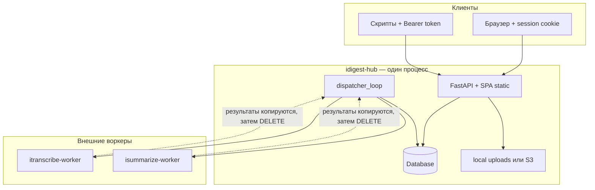

# Обзор архитектуры

[idigest-hub](https://github.com/) — on-premise **multi-tenant control plane** для транскрибации и суммаризации аудио. Конечные пользователи и интеграторы взаимодействуют только с хабом. Внешние worker-сервисы выполняют вычисления; хаб владеет идентичностью, биллингом, артефактами и собственной очередью задач.

## Компоненты

| Слой | Расположение | Ответственность |
| ---- | ------------ | --------------- |
| **Web UI** | `web/` → `web/dist` | React SPA: библиотека, задачи, админка организации, админка инстанса |
| **HTTP API** | `app/main.py`, `app/routers/` | FastAPI на `/api/v1/*`; отдаёт SPA с того же origin |
| **Dispatcher** | `app/services/dispatcher.py` | Фоновый цикл: health checks, dispatch, poll, биллинг при успехе |
| **Database** | SQLite (по умолчанию) или PostgreSQL | Организации, пользователи, задачи, метаданные зашифрованных артефактов |
| **File storage** | `app/services/storage.py` | Audio: локальный диск (`STORAGE_BACKEND=local`) или S3-compatible object storage с SSE (`STORAGE_BACKEND=s3`) |
| **Workers** | Внешние процессы | `itranscribe-worker`, `isummarize-worker` — регистрируются instance admin |



## Принципы проектирования

1. **Single origin** — API и UI разделяют один host/port (по умолчанию `8080`). Session cookie: `HttpOnly` + `SameSite=Lax`; для обычного браузерного использования CORS не нужен.
2. **Workers are opaque** — пользователи организации никогда не видят URL и токены воркеров. Только `instance_admin` регистрирует узлы в Instance → Workers.
3. **Hub-owned queue** — клиенты `POST` задачу → **202** + `task_id` → poll `GET /tasks/{id}`. Хаб зеркалирует состояние воркера и сохраняет готовые артефакты локально.
4. **Tariff snapshot** — цены и лимиты на момент создания задачи сохраняются в строке `Task` (поля `snap_*`), чтобы последующие изменения тарифа не влияли на биллинг текущих и исторических задач.
5. **One Uvicorn worker** — rate limits и состояние dispatcher живут в памяти процесса. Всегда запускайте с `--workers 1`.

## Жизненный цикл процесса

При старте (lifespan в `app/main.py`):

1. Загрузка настроек из `.env`
2. Создание `{DATA_DIR}`, запуск Alembic-миграций (`init_database` → `alembic upgrade head`)
3. Запуск `dispatcher_loop` (async background task, опрос каждые `DISPATCH_POLL_SEC`, по умолчанию 1s)
4. Запуск `rate_limit_sweeper` (очистка in-memory buckets)

При shutdown: фоновые задачи отменяются корректно.

## Модель tenancy

```
Instance (одно развёртывание)
├── instance_admin (один пользователь, создаётся на /setup)
├── InstanceSettings (SMTP, ASR models, rate limits, allow_new_orgs)
├── WorkerNodes[] (transcribe | summarize)
├── Tariffs[]
└── Organizations[]
    ├── org_admin / org_member users (одна org на пользователя)
    ├── balance + tariff
    └── artifacts: Audio, Transcript, Summary, Skill, Task
```

- **Signup** создаёт персональную org (`is_personal=true`) и делает пользователя `org_admin`.
- **Instance admin** по умолчанию не состоит ни в одной org; управляет всем инстансом и может **impersonate** пользователей org для поддержки.

## Поток данных (высокий уровень)

1. Пользователь загружает аудио → `POST /audios` → storage backend сохраняет blob + строка `Audio`
2. Пользователь запускает transcribe → `POST /tasks/transcribe` → `Task` в очереди → dispatcher материализует локальный путь (temp для S3) и POST-ит файл на воркер
3. Воркер завершает работу → хаб шифрует utterances → строка `Transcript` → списание с кошелька → `DELETE` задачи на воркере
4. Пользователь запускает summarize → `POST /tasks/summarize` с `skill_ids` → dispatcher отправляет текст + объединённые skills на summarize worker
5. Успех → зашифрованное тело `Summary` → биллинг → задача на воркере удаляется

Подробные последовательности — в [request-flow.md](request-flow.md).

## Связанные страницы

- [Поток запросов](request-flow.md)
- [Безопасность](security.md)
- [Tasks](../domain/tasks.md)
- [Workers](../operations/workers.md)
