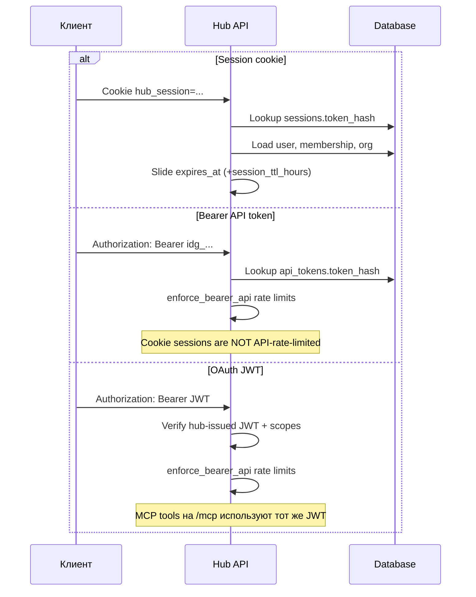
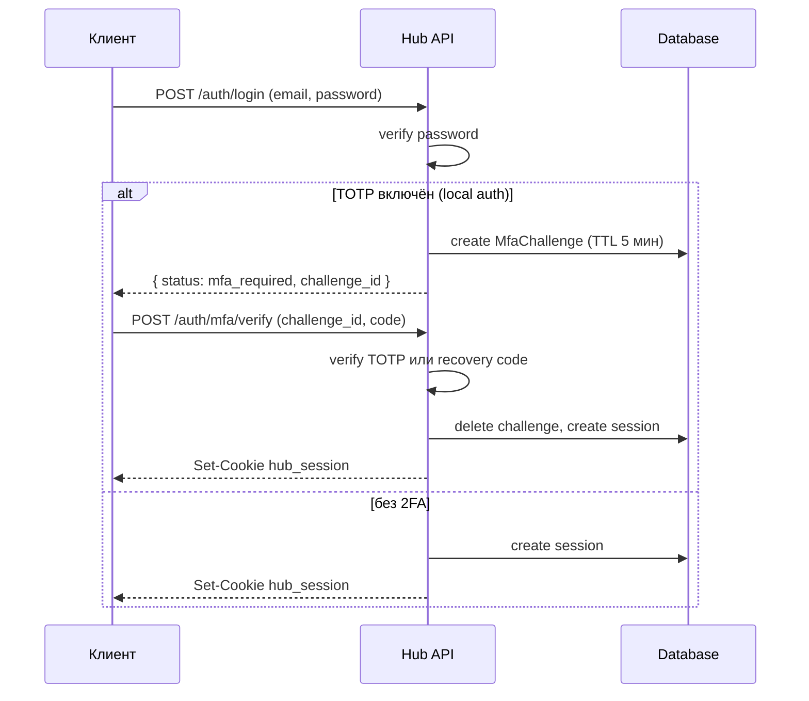
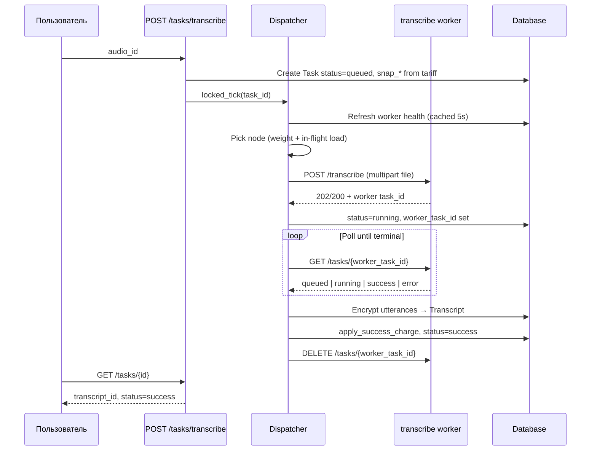

# Поток запросов

На этой странице описано, как HTTP-запросы проходят через аутентификацию, создание задач и фоновый dispatcher.

## Пути аутентификации

Разрешение выполняется в `app/deps.py` → `resolve_auth()`. При ошибках возвращается HTTP **401** с `error.code = unauthorized` (или `must_change_password`, `mfa_enrollment_required`, `api_disabled` для Bearer).

MCP-клиенты вызывают tools на `/mcp` после OAuth authorize/token (см. [MCP API](../api/mcp.md)). Мутации, которые ставят задачу (`create_audio_import`, `create_summary`), после commit запускают dispatcher tick.

### Password login с 2FA

После входа, если org `mfa_required` и пользователь не настроил 2FA, `GET /me` возвращает `mfa_enrollment_required: true`, и большинство маршрутов даёт **403** до успешного `POST /auth/mfa/setup/confirm`.

### Session sliding

Middleware в `app/main.py` повторно выставляет session cookie при успешных ответах, если браузер ещё не получил новый `Set-Cookie`. Каждый аутентифицированный запрос продлевает `expires_at` на `session_ttl_hours` из настроек инстанса (по умолчанию 24 ч, настраивается в Instance → Settings).

## Поток задачи transcribe

### Состояния пула (transcribe)

Перед dispatch dispatcher классифицирует пул transcribe:

| State | Значение |
| ----- | -------- |
| `ready` | Хотя бы один включённый узел имеет ASR + diarization engines в состоянии `loaded` |
| `waiting` | Включённые узлы есть, но engines loading/unavailable — **без dispatch timeout** (`retry_without_timeout=true`) |
| `empty` | Нет включённых узлов или ни один не соответствует требуемым models |

Если пул остаётся `empty` дольше `DISPATCH_NO_CANDIDATE_SEC` (по умолчанию 3600s), задача завершается с ошибкой `error.code = dispatch_timeout`.

## Поток задачи summarize

Аналогично transcribe, но:

1. Хаб расшифровывает utterances транскрипта и форматирует их строками `speaker: text`
2. Skills загружаются по `skill_ids`, объединяются секциями `## name\n\nbody`
3. Размер payload = transcript UTF-8 + skills UTF-8; максимум `MAX_SUMMARIZE_PAYLOAD_BYTES` (10 MiB)
4. Пул воркеров использует `GET /ready` (HTTP 200) вместо engine map
5. Биллинг: фиксированная плата за job + единицы per-1000-character **выходного** текста summary

## Poll on read

`GET /tasks/{task_id}` вызывает `locked_tick`, когда `status` равен `queued` или `running`. UI polling и API-клиенты получают более быстрый отклик, не дожидаясь только фонового цикла.

Фоновый цикл (`dispatcher_loop`) обрабатывает **все** задачи в статусах queued/running каждые `DISPATCH_POLL_SEC` и также выполняет audio retention purge.

## Worker 404 redispatch

Если poll возвращает **404** от воркера и хаб ещё не сохранил результат:

- Очищаются `worker_id` / `worker_task_id`
- `status` возвращается в `queued`
- На следующем tick dispatch идёт на другой узел

Если у хаба уже есть `produced_transcript_id` или `produced_summary_id`, 404 игнорируется (race при cleanup).

## Cancel

`DELETE /tasks/{task_id}` разрешён только когда:

- `status == queued`
- `worker_task_id` ещё null (задача ещё не отправлена на воркер)

Устанавливается `status=error`, `error.code=canceled`. После dispatch cancel отклоняется с `task_running`.

## Распространение ошибок

Ошибки воркера маппятся через `WORKER_ERROR_MAP` в `app/services/workers.py` на hub-facing коды в задаче (`pipeline_error`, `engine_unavailable`, `invalid_file` и т.д.). См. [API errors](../api/README.md#error-codes).

## Связанные страницы

- [Tasks](../domain/tasks.md)
- [MCP tools](../api/mcp.md)
- [Workers](../operations/workers.md)
- [Billing](../domain/billing.md)
