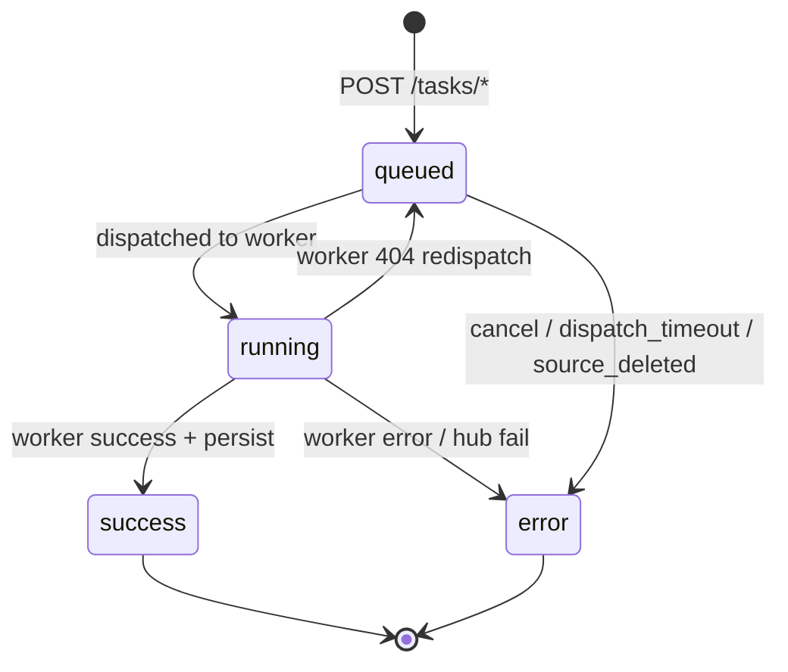

# Задачи

Задачи хаба — пользовательская очередь transcribe и summarize. Они отделяют polling клиента от внутренностей воркеров.

## Типы

| type | Вход | Выход |
| ---- | ---- | ----- |
| `transcribe` | `audio_id` | `produced_transcript_id` |
| `summarize` | `transcript_id` + `skill_ids[]` | `produced_summary_id` |

## Жизненный цикл статуса



| status | Значение |
| ------ | -------- |
| `queued` | Ожидание воркера или engine |
| `running` | Отправлено; установлен `worker_task_id` |
| `success` | Артефакт сохранён, воркер очищен |
| `error` | Терминальный; см. `error.code` |

### Стадии meta (`task.meta.stage`)

Неисчерпывающие значения во время обработки:

- `queued`, `waiting_engine`, `queue_full`, `dispatched`
- Worker-reported `queued` / `running` при polling

## Создание

Оба возвращают **HTTP 202** и JSON задачи (`task_id`, `status`, …).

Предусловия:

- Пользователь в org
- Положительный баланс (если не unlimited tariff)
- Читаемый исходный артефакт
- Summarize: хотя бы один `skill_id`

Немедленный `locked_tick` после insert пытается dispatch без ожидания фонового цикла.

## Polling

`GET /tasks/{task_id}` — запускает tick, когда status `queued` или `running`.

Форма ответа (`task_public`):

```json
{
  "task_id": "uuid",
  "type": "transcribe",
  "status": "success",
  "meta": { "stage": "done", "audio_duration_sec": 120.5 },
  "transcript_id": "uuid",
  "summary_id": null,
  "error": null,
  "org_id": "...",
  "user_id": "...",
  "audio_id": "...",
  "source_transcript_id": null,
  "created_at": "...",
  "updated_at": "..."
}
```

При ошибке: `"error": { "code": "dispatch_timeout" }`.

## Список

`GET /tasks` — сортировка по `updated_at` desc. instance admin может фильтровать `org_id`, `user_id`. org admin — `user_id`.

Дополнительные поля для админов: `owner_email`, `org_name`, `audio_filename`.

## Отмена

`DELETE /tasks/{task_id}`

- Владелец или org_admin в рамках org
- Только пока `status=queued` и ещё не dispatched (`worker_task_id` is null)
- Устанавливает `error.code=canceled`

## Выбор dispatcher

Выбор воркера среди кандидатов:

1. Фильтр enabled-узлов по type и readiness
2. Оценка по `in_flight / weight` (меньше — лучше)
3. Tie-break в сторону большего `weight`

Кандидаты transcribe требуют engine map из `/health` воркера:

- `snap_asr_model` (по умолчанию `whisper`) status `loaded`
- `snap_diarization_model` (опционально) status `loaded`

Кандидаты summarize требуют `/ready` HTTP 200.

## Коды ошибок (`task.error.code`)

| code | Типичная причина |
| ---- | ---------------- |
| `dispatch_timeout` | Нет доступного воркера за `DISPATCH_NO_CANDIDATE_SEC` |
| `canceled` | DELETE пользователем в queued |
| `source_deleted` | Audio/transcript удалён до persist |
| `text_too_long` | Payload summarize > 10 MiB |
| `payload_too_large` | Воркер отклонил размер upload |
| `engine_unavailable` | Модели не загружены (может retry) |
| `pipeline_error` | Общая ошибка воркера/обработки |
| `invalid_file` | Плохое audio |
| `not_found` | Отсутствует ссылка на skill |

Коды воркера мапятся в `app/services/workers.py` → коды хаба.

## Хук биллинга

Только при success: `apply_success_charge()` по зафиксированным ценам. Неудачные задачи не тарифицируются.

## Фоновая обработка

`dispatcher_loop` каждые `DISPATCH_POLL_SEC` (1s):

1. Обновить health воркеров (кэш 5s на узел)
2. Poll running tasks
3. Dispatch queued tasks
4. Запустить purge audio retention

Настраивается через `.env`:

| Variable | Default |
| -------- | ------- |
| `DISPATCH_NO_CANDIDATE_SEC` | 3600 |
| `DISPATCH_POLL_SEC` | 1.0 |
| `WORKER_HTTP_TIMEOUT_SEC` | 30 |
| `WORKER_UPLOAD_TIMEOUT_SEC` | 300 |

## Связанные страницы

- [Поток запросов](../architecture/request-flow.md)
- [Биллинг](billing.md)
- [Tasks API](../api/tasks.md)
